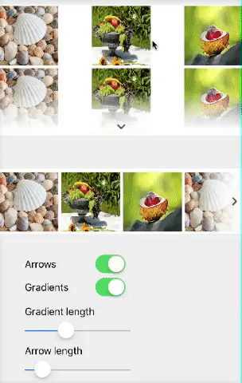

# FadingEdgesCollectionView
A UICollectionView that fades its edges to hint about more content.

Vertical and/or horizontal fading/arrows are shown automatically - just set the class to `FadingEdgesCollectionView` in storyboard or create as a usual UICollectionView programmatically.

## Installation

Available via CocoaPods:

    pod 'FadingEdgesCollectionView'

Or download and get files from /Lib directory.

